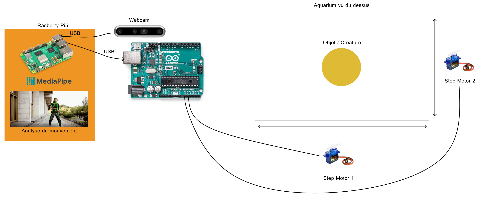

# Interaction aquarium

## Things to know 

This projects works with Raspberry 4 and previous version. For now, it can't work with Raspberry 5 because no version of google mediapipe works with an ARM achitecture.

## Global structure

This project uses an Arduino Giga R1, A Webcam (whathever camera you like), a Rasberry Pi 4, and 2 Stepmotors. 

## Technical Informations
Here are the set-up with the name of the different components as they are then used in the code.

